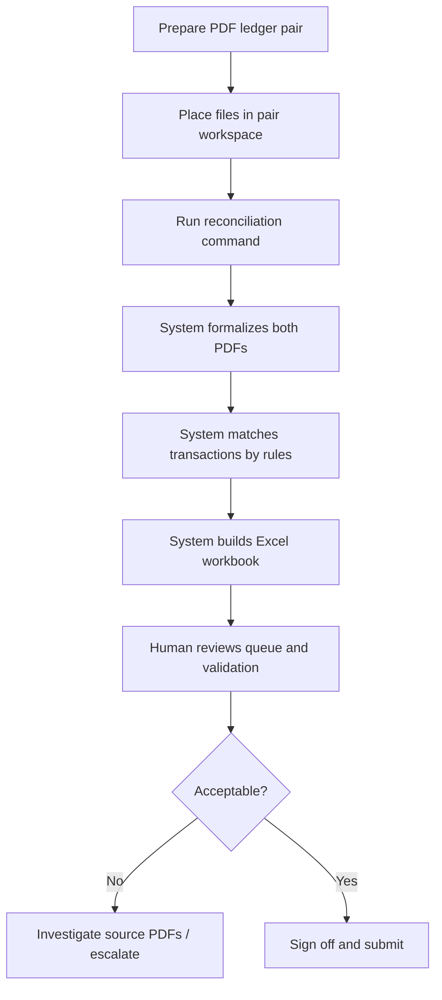

# Non-Technical Documentation — Finance Ledger Reconciliation Automation

## 1. Plain-English Overview

### What this project does

**Confirmed from repository:** This is a **local computer program** used inside the office to help reconcile two related accounting ledgers:

- the **organisation ledger** (your company’s books for a trading partner), and  
- the **party ledger** (the partner’s books as they see the relationship).

The program reads the original **PDF ledger files**, turns them into structured spreadsheets, compares transactions using **fixed, written rules**, and produces a **reconciliation workbook** suitable for finance review and submission—after a human has checked the flagged items.

### Who uses it

| Role | Typical use |
|------|-------------|
| Finance operator | Runs the program, reviews outputs |
| Reconciliation reviewer | Checks matches, review queue, validation report |
| Manager / sign-off owner | Approves workbook before submission |
| Technical maintainer | Installs updates, configures optional AI settings |
| Auditor | Traces figures back to source PDFs and row IDs |

### Business problem solved

Reconciling two PDF ledgers by hand is slow, inconsistent, and hard to defend in an audit. The system:

- preserves **original source evidence** (page numbers, raw text),
- applies the **same matching rules every time**,
- surfaces **uncertain items for human review** instead of hiding them,
- produces a **standard workbook layout** modeled on an existing reference template.

### What you need to provide

- A **ledger pair**: organisation PDF + party PDF, placed in the correct project folder for that pair.
- Optional: a configured `.env` file only if you intentionally enable AI assistance (not required for normal runs).

### What you receive

- A **formalized workbook** — both ledgers in a standard column layout with audit sheets.
- A **final reconciliation submission workbook** containing Summary, match table, annexures by transaction type, review queue, validation report, and formula audit.

### Decisions the system supports

- Which organisation and party transactions **likely belong together** (strong matches).
- Which items are **possible matches needing review** (candidates).
- Which items **could not be matched** under the rules.
- Which rows had **extraction or classification problems** during formalization.

### Decisions that still require human review

- Every row in the **Review Queue** (especially HIGH priority).
- Any **Validation_Report** row marked `REVIEW` or `FAIL`.
- **Candidate matches** (not marked as strong matches).
- **Unknown** transaction types and the optional **Unknown_Needs_Review** annexure.
- **Closing balance differences** between the two ledgers.
- Final **approval for submission** to the finance team.

---

## 2. Business Workflow

### Step-by-step



1. **What you prepare**  
   Obtain the latest organisation and party ledger PDFs for the period. Confirm they are the correct accounts and date range.

2. **What the system reads**  
   PDF files from the pair’s input folders. It does not modify these files.

3. **How processing works (plain language)**  
   - **Formalization:** The program reads each PDF page, detects columns and rows, classifies transaction types (Invoice, Payment, etc.), normalizes reference numbers, and writes a structured workbook with an audit trail.  
   - **Reconciliation:** The program compares organisation and party **transaction rows only**, using reference numbers, amounts, dates, and transaction types under strict staged rules.  
   - **Workbook generation:** It builds summary totals, annexures by type, a master match list, and review/validation sheets.

4. **Where AI may be used (optional)**  
   By default, **AI is turned off**. If explicitly enabled by a maintainer, AI may help with: reading difficult column layouts, suggesting dates for a small number of failed rows, or suggesting a standard label for “unknown” transaction types. AI is **never** used to decide final matches.

5. **Where fixed rules are used**  
   All matching, summary calculations (via spreadsheet formulas tied to match results), annexure layout, and validation checks use **deterministic rules** in the program.

6. **How matching decisions are made**  
   The system tries stronger evidence first (exact reference + amount), then weaker evidence (partial reference, fuzzy reference, or amount+date without reference). Strong matches require solid reference evidence. Weak cases are marked for **manual review**, not auto-approved.

7. **Outputs generated**  
   See Section 4.

8. **How you should review results**  
   Start with Validation_Report (fix FAIL, assess REVIEW), then Review_Queue (HIGH first), then Summary closing difference and Status, then non-strong rows in Master_Match_Table.

9. **If results look wrong**  
   Trace the row back to the raw ledger sheet using `source_row_id`, open the source PDF at the listed page, and compare. Do not assume strong matches are correct without spot-checking high-value items.

---

## 3. Roles and Responsibilities

| Role | Responsibilities |
|------|------------------|
| **Business user / finance operator** | Place correct PDFs; run the approved command; perform first-pass review; fill reviewer columns in Excel where needed |
| **Technical maintainer** | Install Python environment; manage `.env`; run tests after changes; never commit secrets or financial files to remote repos |
| **Reviewer / auditor** | Verify Review_Queue resolution; confirm Validation_Report; sample strong matches; confirm closing balances |
| **Data owner** | Ensures PDFs are complete, current, and authorized for processing |
| **Escalation owner** | Decides on unresolved matches, policy exceptions, and final submission approval |

**Confirmed from repository (README):** Before team submission, a human must review Review_Queue, Validation_Report, Summary status, candidate matches, and leave reviewer-owned columns appropriately completed.

---

## 4. Inputs and Outputs

### Input files

| Input | Description | Required? |
|-------|-------------|-----------|
| Organisation ledger PDF | Your company’s ledger for the party | Yes |
| Party ledger PDF | Counterparty’s ledger | Yes |
| `config/type_labels.json` | Dictionary mapping raw type words to standard labels | Yes (supplied with project) |
| Reference Excel workbook | Visual template for formatting | Optional |
| `.env` configuration | AI and path settings | Optional (defaults work for deterministic runs) |

**Required content in PDFs (business view):** transaction dates, amounts, references/voucher numbers, and transaction types as they appear in the source. If these are missing or unreadable, the system flags rows for review—it does not invent missing values.

### Output files

| Output | Plain-English meaning |
|--------|----------------------|
| `formalized_ledgers__<pair>.xlsx` | Both ledgers converted to standard columns with extraction audit |
| `final_recon_submission__<pair>.xlsx` | Main deliverable for finance review |
| `recon_workbook__<pair>.xlsx` | Same content under an internal name (Confirmed from repository: copied to submission name) |
| Central copies under `data/04_outputs/` | Archive-friendly copies of the above |
| Run manifest JSON | Record of which pairs ran, paths, and success/failure |

### Important workbook sheets (final submission)

| Sheet | What it shows |
|-------|---------------|
| **README** | Orientation and warnings |
| **Executive_Summary** | High-level counts and status snapshot |
| **Org / Party raw sheets** | Every formalized row with source trace fields |
| **Working org / party** | Rows prepared for calculations (net amounts as formulas) |
| **Summary** | Opening/closing balances, totals by transaction type, matched/unmatched amounts, validation status |
| **Master_Match_Table** | Every match attempt: strong, candidate, or unmatched |
| **Annex_&lt;type&gt;** | Detail for each standard type (Invoice, Payment, etc.) |
| **Unknown_Needs_Review** | Only if unclassified types exist |
| **Review_Queue** | Prioritized list of items needing human attention |
| **Validation_Report** | Automated checks with PASS / REVIEW / FAIL / INFO |
| **Formula_Audit** | Confirms calculated cells use formulas correctly |
| **Assumptions_And_Limits** | Documented constraints of the process |

### Reviewer-owned columns (always start blank)

`reviewer_comment`, `manual_status`, `resolved_by`, `resolved_date` — intended for you to complete in Excel during review.

---

## 5. How Tables and Reports Are Made

### From PDF to table

1. The program extracts text and table structure from each PDF page.  
2. Each logical row becomes a record with: date, type, reference, amounts, particulars, page number, and original raw text.  
3. Transaction types are mapped to **standard labels** (e.g. “Sale” and “Purchase” both map to **Invoice** for grouping purposes—this is **not** a statement that the transactions are the same event).  
4. Reference numbers are **normalized** ( punctuation removed, uppercased ) so “SA/PB/001” and “SAPB001” can compare consistently.

### What each major table is meant to show

| Table | Purpose |
|-------|---------|
| **Summary** | Big-picture: do org and party totals align by category? What is matched vs unmatched? |
| **Master_Match_Table** | Line-by-line evidence of what was paired or left open |
| **Annex sheets** | Drill-down for one transaction type at a time |
| **Review_Queue** | Your to-do list |
| **Validation_Report** | Automated quality gate |

### Calculations performed

**Confirmed from repository:** Most rollups in Summary and annexures are **Excel formulas** (e.g. SUMIFS) written by the program. They sum amounts from Working sheets and Master_Match_Table based on transaction type and match status.

**Working sheet net amounts:**

```text
Net (source view) = Debit − Credit
Net (organisation perspective) = Org debit − Org credit
```

**Match amount difference (each matched row):**

```text
Difference = | |Org amount| − |Party amount| |
```

**Summary difference columns:**

```text
Difference = Organisation amount − Party amount
```

These formulas are created in the workbook; changing them manually may break the Formula_Audit checks.

### What to review manually

- All Review_Queue HIGH items  
- Validation_Report FAIL and REVIEW rows  
- Master_Match_Table rows where `match_status` is not `matched_strong`  
- Summary **Closing Balance Difference** and **Status**  
- Unknown types and AI-repaired dates (if AI was used)

### Common reading mistakes

| Mistake | Reality |
|---------|---------|
| “Invoice on both sides means same document” | Invoice is a **category label**, not proof of a match |
| “Strong match = approved” | Strong means rules passed; you should still spot-check material amounts |
| “Blank Review_Queue = perfect books” | Validation_Report may still show REVIEW items |
| Editing evidence columns | Raw reference and particulars columns must stay as extracted |

---

## 6. Matching and Decision Rules

### What is being matched

**Organisation transaction rows** are compared to **party transaction rows** for the same ledger pair and period.

### Why matching is needed

Each side records the same commercial events in its own format. Reconciliation identifies corresponding entries and highlights gaps.

### What information is compared

| Factor | Used for |
|--------|----------|
| Normalized reference number | Primary evidence |
| Amount (organisation perspective) | Must be within **₹0.01** tolerance (Confirmed: `0.01` in code) |
| Date | Within **7 days** for weaker match stages |
| Transaction type | Required for some stages; mirror pairs allowed (e.g. Receipt vs Payment) |

### How confident matches are selected

The system applies **stages in order**:

1. **Exact reference + amount** (+ type when possible) → **Strong match** if only one candidate.  
2. **Exact reference + amount** (type not required) → **Strong match** if only one candidate.  
3. **Partial reference containment + amount + date** → **Strong match** if both references present.  
4. **Similar reference (fuzzy) + amount + date** → **Candidate for review** (never strong).  
5. **Missing reference but amount + date + compatible type** → **Candidate for review** (never strong).  
6. Remaining org rows → **Unmatched organisation**.  
7. Remaining party rows → **Unmatched party**.

If multiple rows share the same reference and amount, the system **does not guess**—it marks **candidate for review**.

### When a match may be wrong

- Duplicate reference numbers on one side  
- Missing or incorrect references in the PDF extraction  
- Amount typos within tolerance  
- Date ambiguity near the 7-day window  
- Fuzzy reference similarity (always requires review)

### When manual review is required

Any row with `review_required = TRUE`, unmatched status, unknown type, formalization flags, closing balance mismatch, or Validation_Report REVIEW/FAIL.

### Why deterministic matching is safer than unnecessary AI

Matches affect financial conclusions. Fixed rules are **repeatable**, **explainable** (each row shows `match_rule`), and **free of model hallucination**. AI in this project is limited to reading messy inputs—not deciding matches.

### What to check before trusting results

- [ ] Validation_Report has no FAIL  
- [ ] Review_Queue reviewed and documented  
- [ ] Sample of strong matches verified against PDFs  
- [ ] Closing balances understood  
- [ ] Unknown types resolved or explicitly accepted  

---

## 7. AI Usage Explained

### What AI is used for (only when enabled)

| Task | Plain explanation |
|------|-------------------|
| Layout profiling | Help interpret column layout from a **small sample** of lines |
| Failed row repair | Suggest a **date** for a few party rows the parser could not read confidently |
| Unknown label grouping | Suggest which **predefined** standard label fits an unknown raw type |
| Legacy standardization | Separate optional path—not used in the default reconciliation command |
| Connectivity check | During reconciliation build, a **empty test message** may verify AI is reachable—**no ledger data sent** |

### What AI is **not** used for

- Deciding whether two transactions match  
- Calculating summary totals or closing balances  
- Creating new transaction types not in the config file  
- Sending whole PDF files or full ledgers to a model (by design)

### Default setting

**Confirmed from repository:** `AI_ENABLED=false` and `AI_FORMALIZATION_MODE=off`. The recommended production command uses **no AI**.

### Why AI is limited

- **Cost control** — token limits cap each request.  
- **Risk control** — models can be wrong; matches stay rule-based.  
- **Auditability** — deterministic steps can be replayed.  
- **Privacy** — financial text stays local unless a maintainer explicitly approves hosted AI.

### What humans must still verify

Everything in the Review_Queue, all Validation FAIL/REVIEW items, candidate matches, and any row marked as AI-repaired or AI-suggested.

### Data that may be sent to AI (if enabled)

- Small text snippets from failed rows (capped length)  
- Sample layout lines (capped count)  
- Lists of unknown raw type strings  
- **Not** sent: full ledgers, match decisions, or PDF binaries (Confirmed from repository: project rules and AI module comments)

### If AI output is wrong or unavailable

- Wrong suggestions are rejected or flagged; source fields are preserved.  
- If AI is unavailable, the deterministic pipeline **still completes**; more rows may appear in Review_Queue.

---

## 8. Metrics and Monitoring

### What is tracked today

| Metric | Meaning for business users |
|--------|---------------------------|
| Strong match count | Rows paired with high-confidence rules |
| Review / candidate count | Items needing your attention |
| Unmatched org / party counts | Items with no pairing under rules |
| Review queue size | Your workload indicator |
| Validation FAIL count | Automated blockers—must be resolved |
| Formula audit FAIL count | Spreadsheet integrity problem—technical follow-up |
| AI usage count (formalization) | How many optional AI calls ran (if AI enabled) |
| AI repair applied / rejected | How many AI date fixes accepted vs rejected |

### What is **not** tracked today

```text
The repository does not currently provide sufficient logged token-usage data to calculate real average input/output token usage. The formulas and recommended instrumentation are documented below, but no production metric should be inferred without logs.
```

There is no built-in dashboard for:

- Exact AI token consumption per run  
- Dollar cost per reconciliation  
- Average processing time across pairs  

The program logs **estimated** input tokens before AI calls, not actual billed usage.

### Tokens explained simply

- **Input tokens** — text sent into the AI system (your prompt and data snippets).  
- **Output tokens** — text the AI sends back.  
- **Higher token usage** usually means **higher cost** and **longer wait time**.

### Recommended metrics to start collecting (Recommendation)

- Number of AI calls per run  
- Actual input/output tokens from provider responses  
- Review queue size trend over time  
- Validation FAIL rate per pair  
- Time to complete each pair  

---

## 9. Risks and Controls

| Risk | Why it matters | Warning signs | Prevention / control | What you should do |
|------|----------------|---------------|----------------------|-------------------|
| Wrong input PDFs | Entire reconciliation invalid | Wrong vendor name, wrong period | Verify PDF identity before run | Stop and replace files |
| Wrong matches | Incorrect financial conclusion | Unexpected strong matches | Review queue + sampling | Mark manual_status; escalate |
| Over-trusting AI | Bad dates or labels accepted | Many AI-repaired rows | Keep AI off by default | Re-verify against PDF |
| Skipping manual review | Errors reach submission | Empty reviewer comments but open issues | Follow README checklist | Complete Review_Queue |
| Data privacy | Confidential data leaves office | Hosted AI enabled without approval | Default `local_only` | Confirm with maintainer |
| Outdated files | Stale reconciliation | Old period in PDF header | Use latest statements | Re-run with current PDFs |
| Changed PDF format | Extraction quality drops | Validation REVIEW on parse rates | Formalization audit sheets | Escalate to maintainer |
| Incomplete outputs | False sense of completion | Missing sheets in workbook | Run inspect command | Re-run build; check manifest |
| Misread Summary | Wrong decision from totals | Formula errors | Formula_Audit PASS | Ask maintainer if FAIL |
| Untracked AI cost | Budget surprise | Many repair batches | Limit `--ai-repair-batches` | Track maintainer reports |
| Undocumented process changes | Audit gap | Ad-hoc Excel edits to logic | Change control | Document approvals |

---

## 10. User Operating Guide

### Before running

- [ ] Confirm correct ledger pair folder and PDFs  
- [ ] Confirm period matches management request  
- [ ] Confirm whether this run should be **deterministic (no AI)** — default yes  
- [ ] Ensure prior submission copies are archived if overwriting  
- [ ] Maintainer has run tests after any recent code change  

### Running

- [ ] Open PowerShell at project root  
- [ ] Run the approved command (see below)  
- [ ] Wait for completion message with output paths  
- [ ] Note run manifest path if batch run  

**Standard command (Confirmed from repository):**

```powershell
.\.venv\Scripts\python.exe -m src.reconciliation.build_all_recon_workbooks --refresh-formalized
```

Single pair:

```powershell
.\.venv\Scripts\python.exe -m src.reconciliation.build_recon_workbook --pair-id pair_001_baby_and_mom__good_luck --refresh-formalized
```

### After running

- [ ] Open `final_recon_submission__<pair>.xlsx`  
- [ ] Run inspect tool if maintainer provides command  
- [ ] Save a dated copy for records  

**Inspect command:**

```powershell
.\.venv\Scripts\python.exe -m src.tools.inspect_recon_workbook "data/02_work_pairs/<pair_id>/output/final_recon_submission__<pair_id>.xlsx"
```

### Review checklist

- [ ] Validation_Report: zero FAIL; all REVIEW assessed  
- [ ] Review_Queue: all HIGH resolved or documented  
- [ ] Summary: Status and closing difference acceptable  
- [ ] Master_Match_Table: candidates and unmatched explained  
- [ ] Unknown_Needs_Review (if present): disposition recorded  
- [ ] Reviewer columns completed where decisions made  

### Escalation checklist

- [ ] Attach row IDs and PDF page references  
- [ ] State whether issue is extraction, matching, or source data  
- [ ] Do not submit until escalation owner responds  
- [ ] Preserve formalized workbook + submission + manifest  

---

## 11. FAQ

**Can the system be trusted without review?**  
No. The README explicitly requires human review before team submission. Strong matches are rule-based, not guaranteed correct.

**Where is AI used?**  
Only in optional formalization helpers and a separate legacy standardization path—**not** in matching. Default configuration uses no AI.

**Does AI make final match decisions?**  
No. **Confirmed from repository:** validation includes `no_reconciliation_ai_decisions` as a permanent PASS assertion.

**What should I do if a match looks wrong?**  
Document in `reviewer_comment` / `manual_status`, verify both sides in the PDF using row IDs, and escalate if material.

**What does token usage mean?**  
Tokens measure how much text is sent to and received from an AI service. This project caps them but does not currently log actual totals for finance users.

**Why are some steps deterministic?**  
So the same inputs produce explainable, auditable results without model randomness.

**What happens if input data is missing?**  
Fields stay empty; rows are flagged for review. The system does not invent missing references or amounts.

**How do I know the output is complete?**  
Check required sheets exist (inspect tool), run manifest shows success, and Validation_Report has no FAIL.

**Who should approve final results?**  
Your organisation’s designated reconciliation sign-off owner (escalation owner)—not the software alone.

**What should be documented for audit?**  
Source PDFs, run date, command used, output workbook copies, run manifest, reviewer decisions on Review_Queue, and `.env` AI settings (not secrets).

---

## 12. Limitations

### Confirmed limitations (plain language)

- The system matches **one org row to one party row**; it cannot split a single payment across many invoices automatically.  
- It cannot read **scanned image-only PDFs** reliably (OCR path is not implemented).  
- **Optional AI date repair** applies only to the party ledger, not the organisation ledger.  
- **Working sheets** do not show match IDs; use Master_Match_Table for pairings.  
- The separate **AI standardization** feature is not part of the default reconciliation command.  

### Missing information

- No built-in cost report for AI usage.  
- No web interface—command line only.  
- Package description file (`pyproject.toml`) may not reflect full scope; rely on this documentation and README.

### Assumptions

- PDFs contain machine-readable text (not pure images).  
- Reference numbers and amounts in source documents are mostly correct.  
- Reviewers have access to original PDFs for verification.

### Items requiring technical review

- Enabling any AI mode  
- Changing type labels in config  
- Changing matching tolerances (requires code change by maintainer)  
- Any Validation_Report or Formula_Audit FAIL  

---

## Evidence discipline note

Statements in this document labeled **Confirmed from repository** are grounded in source code, README, or configuration files in the project. Items marked **Recommendation** are suggested improvements not yet implemented. Where evidence was incomplete, this is stated explicitly rather than guessed.

---

*End of Non-Technical Documentation*
