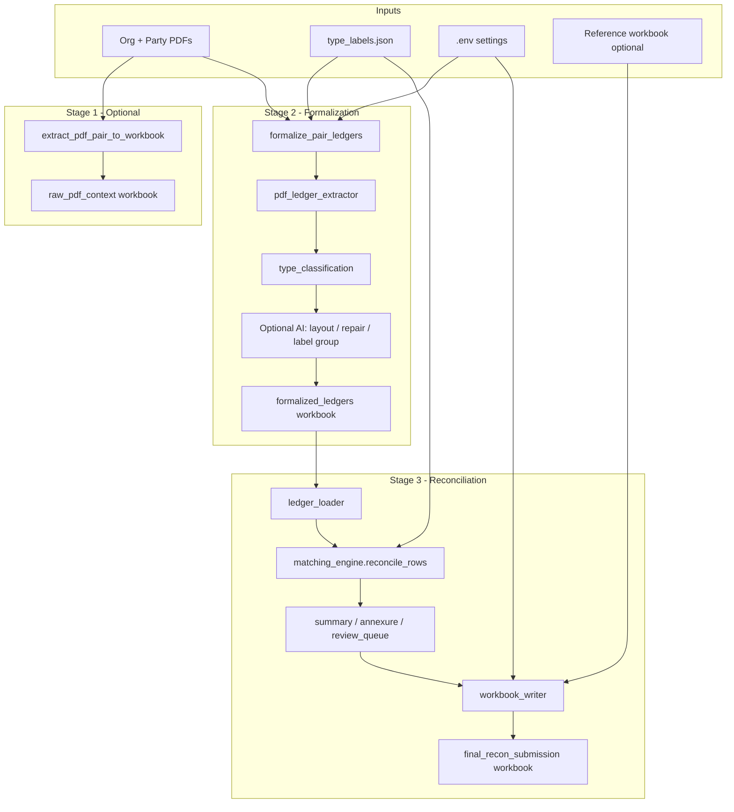
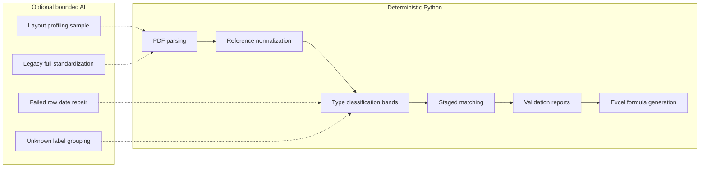
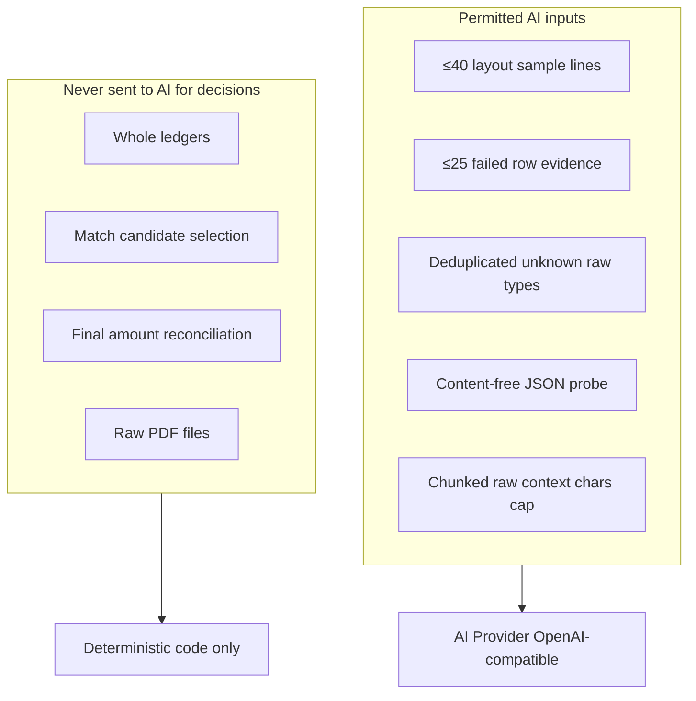

# Technical Documentation — Finance Ledger Reconciliation Automation

## 1. Document Control

| Field | Value |
|-------|-------|
| **Document title** | Technical Documentation — Finance Ledger Reconciliation Automation |
| **Project name** | `finance-recon` (Confirmed from repository: `pyproject.toml`) |
| **Repository scope** | Local Python project at repository root; processes organisation/party ledger PDF pairs into formalized and reconciliation Excel workbooks |
| **Documentation date** | 2026-06-01 |
| **Intended audience** | Software engineers, maintainers, auditors, future developers |
| **Evidence basis** | Source code under `src/`, configuration under `config/` and `.env.example`, tests under `tests/`, `README.md`, sample output paths referenced in code and README |
| **Known evidence gaps** | See Section 18 |

---

## 2. Executive Technical Summary

### What the system does

**Confirmed from repository:** This is a local, office-internal tool that reconciles accounting ledgers between an organisation and its trading parties. Given a **ledger pair** (organisation PDF + party PDF), the pipeline:

1. Optionally extracts raw PDF context to an audit workbook.
2. **Formalizes** both PDFs into a strict, two-ledger Excel workbook with canonical schema, traceability fields, and validation.
3. **Reconciles** organisation and party transactions deterministic-first, optionally arbitrates unresolved clusters with AI, deterministically post-validates accepted placements, then writes submission-quality Excel workbooks.

### Problem solved

Manual reconciliation of PDF ledgers is slow, error-prone, and hard to audit. The system automates structured extraction, standardized typing, deterministic-first matching, bounded AI arbitration, and workbook generation while preserving source evidence and human review surfaces.

### Primary inputs

- Source PDFs per pair under `data/02_work_pairs/<pair_id>/input/org_ledger/` and `.../party_ledger/` (Confirmed from repository: `README.md`, `pdf_ledger_extractor.discover_pair_pdfs`)
- Canonical type labels: `config/type_labels.json`
- Optional reference workbook for visual theming: `data/03_reference_workbooks/old_recon_workbooks/`
- Environment configuration: `.env` (from `.env.example`)

### Primary outputs

| Output | Path pattern |
|--------|--------------|
| Raw context workbook | `data/02_work_pairs/<pair_id>/output/raw_pdf_context__<pair_id>.xlsx` |
| Formalized workbook | `data/02_work_pairs/<pair_id>/output/formalized_ledgers__<pair_id>.xlsx` |
| Reconciliation workbook | `data/02_work_pairs/<pair_id>/output/recon_workbook__<pair_id>.xlsx` |
| Final submission copy | `data/02_work_pairs/<pair_id>/output/final_recon_submission__<pair_id>.xlsx` |
| Clean team workbook | `data/02_work_pairs/<pair_id>/output/team_recon_submission__<pair_id>.xlsx` |
| Central copies | `data/04_outputs/...` |
| Run manifest | `data/04_outputs/run_manifests/recon_run_<timestamp>.json` |

### Core reconciliation pipeline

```
PDF pair → formalize_pair_ledgers → formalized workbook
         → load_formalized_ledgers → reconcile_rows
         → optional ai_match_arbitration → deterministic post-validation
         → workbook_writer → internal audit Excel
         → team_workbook_builder → clean finance-team Excel
```

First-pass matching, post-validation, annexures, summary formulas, and formula audit remain deterministic Python. AI authority is restricted to unresolved clusters inside `ai_match_arbitration.py`.

### Where AI is used

| Stage | Module | Mode / trigger |
|-------|--------|----------------|
| Formalization (optional) | `ai_layout_profiler.py` | `AI_FORMALIZATION_MODE=layout_only` |
| Formalization (optional) | `ai_failed_row_repair.py` | `AI_FORMALIZATION_MODE=repair_failed_rows` |
| Formalization (optional) | `ai_label_grouping.py` | `AI_FORMALIZATION_MODE=group_unknown_labels` |
| Legacy standardization (off main path) | `standardize_pair_with_ai.py` | `AI_ENABLED=true` + approval |
| Reconciliation arbitration (optional) | `ai_match_arbitration.py` | `AI_RECONCILIATION_ENABLED=true`, `AI_RECONCILIATION_MODE=arbitrate` |

**Default production path:** `AI_FORMALIZATION_MODE=off`, `AI_ENABLED=false` — no model calls.

### Where AI is intentionally bounded

- Deterministic strong matches (`matching_engine.reconcile_rows`) are never sent to AI
- Annexure assignment
- Summary balance/match aggregation logic (Excel formulas reference deterministic match outputs)
- Final validation pass/fail decisions for AI placements remain deterministic
- Reference normalization and type classification core (deterministic labeler with optional AI grouping overlay)

### Key architectural decisions

1. **Staged pipeline** with per-pair workspaces (`data/02_work_pairs/`) for audit isolation.
2. **Source preservation:** raw text, page numbers, extraction method never overwritten by AI on forbidden fields.
3. **AI as bounded arbiter for unresolved evidence only** — final placement requires deterministic post-validation.
4. **Double-write reconciliation workbook:** first write collects formula audit; second write embeds validation derived from audit (Confirmed from repository: `build_recon_workbook.py` lines 210–228).
5. **Excel formulas for financial rollups** — Python writes structure and match facts; SUMIFS/COUNTIF carry aggregations.

### Operational boundaries

- Local processing of financial documents; hosted AI blocked unless `AI_DATA_APPROVAL=hosted_approved`.
- Source PDFs and uploads are never mutated or deleted (Confirmed from repository: project rules, README).
- No web UI or API server — CLI modules only.

---

## 3. Repository Structure

```
recon/
├── config/type_labels.json          # Canonical label → alias map (core config)
├── data/
│   ├── 00_original_uploads/         # Untouched upload copies (support)
│   ├── 01_source_ledgers/           # Source PDFs by role (support/input staging)
│   ├── 02_work_pairs/               # Core per-pair workspace (input/output/audit)
│   ├── 03_reference_workbooks/      # Reference Excel templates (support)
│   ├── 04_outputs/                  # Generated central copies, manifests, caches
│   └── 99_archive/                  # Archive (support)
├── docs/                            # Documentation (this file)
├── scripts/                         # Windows runner scripts for AI standardization
├── src/
│   ├── config.py                    # Central settings (core)
│   ├── extraction/                  # Raw PDF → context workbook (stage 1, optional)
│   ├── formalization/               # PDF → formalized workbook (stage 2, core)
│   ├── reconciliation/            # Matching + workbook generation (stage 3, core)
│   ├── standardization/           # Legacy AI standardization path (compatibility)
│   ├── providers/                 # AI client abstraction (support)
│   ├── excel/                       # Reference profiling, I/O helpers (support)
│   └── tools/                       # Inspection, source dump utilities (support)
├── tests/                           # Pytest suite (28 project test modules)
├── .env.example                     # Canonical env template (config)
├── requirements.txt                 # Dependencies (config)
└── pyproject.toml                   # Package metadata (config)
```

### Important paths

| Path | Purpose | Role | Canonical? |
|------|---------|------|------------|
| `src/formalization/formalize_pair_ledgers.py` | Formalization orchestrator | Core pipeline | Yes |
| `src/reconciliation/build_recon_workbook.py` | Single-pair recon builder CLI | Core pipeline | Yes |
| `src/reconciliation/build_all_recon_workbooks.py` | All-pairs runner + manifest | Core pipeline | Yes |
| `src/reconciliation/matching_engine.py` | Deterministic matching | Core algorithm | Yes |
| `src/config.py` | Settings + AI gates | Core config | Yes |
| `config/type_labels.json` | Type label dictionary | Core config | Yes |
| `src/standardization/standardize_pair_with_ai.py` | Full AI standardization | Legacy / parallel | No (not wired to recon builder) |
| `src/extraction/extract_pdf_pair_to_workbook.py` | Raw context extraction | Optional audit stage | Yes for that stage |
| `data/04_outputs/formalization_ai_cache/` | SHA256 AI response cache | Generated | N/A |

---

## 4. Architecture Overview

### High-level architecture



### Deterministic pipeline boundary



### AI usage boundary



### Data flow


---

## 5. End-to-End Pipeline

### Stage 0: Pair workspace setup

| Attribute | Detail |
|-----------|--------|
| **Purpose** | Isolate each org/party pair with inputs and outputs |
| **Input** | PDFs in `data/02_work_pairs/<pair_id>/input/{org_ledger,party_ledger}/` |
| **Output** | Workspace folders: `output/`, `audit/`, `notes/` |
| **Source** | Data layout documented in `README.md` |
| **Deterministic** | Yes |
| **AI** | None |
| **Failure** | Missing `input/` prevents pair discovery |
| **Downstream** | All stages |

### Stage 1: Raw PDF context extraction (optional)

| Attribute | Detail |
|-----------|--------|
| **Purpose** | Audit-friendly dump of PDF text, lines, blocks, words, tables |
| **Input** | Pair PDFs |
| **Output** | `raw_pdf_context__<pair_id>.xlsx` |
| **Source** | `src/extraction/extract_pdf_pair_to_workbook.py` → `run_extraction()` |
| **Deterministic** | Yes — PyMuPDF + pdfplumber; no AI, no OCR |
| **AI** | None |
| **Validation** | Manifest and audit sheets in output workbook |
| **Failure modes** | Missing PDF, unreadable file |
| **CLI** | `python -m src.extraction.extract_pdf_pair_to_workbook --pair-id <id> [--pair-root]` |

**Why it exists:** Independent audit trail of raw extraction before formalization.

**If changed:** Downstream formalization does not depend on this stage; it reads PDFs directly.

### Stage 2: Deterministic formalization

| Attribute | Detail |
|-----------|--------|
| **Purpose** | Parse PDFs into canonical two-ledger workbook |
| **Input** | Pair PDFs, `config/type_labels.json`, `.env` formalization settings |
| **Output** | `formalized_ledgers__<pair_id>.xlsx` + central copy |
| **Source** | `formalize_pair_ledgers.py`, `pdf_ledger_extractor.py`, `type_classification.py`, optional `ai_*.py` |
| **Deterministic core** | PDF parsing, row assembly, reference normalization, type banding, org-perspective mirroring |
| **Optional AI** | `layout_only`, `repair_failed_rows`, `group_unknown_labels` (gated) |
| **Validation** | `formalization/validation.py` → `Validation_Report` sheet |
| **Failure modes** | PDF parse failure, missing second ledger sheet, traceability gaps (FAIL) |
| **CLI** | `python -m src.formalization.formalize_pair_ledgers --pair-id <id>` |

**Procedure (Confirmed from repository):**

1. Discover PDFs per role (`discover_pair_pdfs`).
2. Extract pages via strategies A (pdfplumber table), B (coordinate), C (line); E (OCR) is stub.
3. Assemble `LedgerRow` via `_assemble_row()`: classify type, normalize reference, compute org perspective.
4. Optional AI layout profiling on low-confidence pages.
5. Optional AI unknown-label grouping batch.
6. Optional AI failed-row date repair (party ledger only).
7. Write workbook via `formalization/workbook_writer.py`.
8. Build validation report.

**Downstream:** Reconciliation requires formalized workbook.

### Stage 3: Reconciliation workbook generation

| Attribute | Detail |
|-----------|--------|
| **Purpose** | Match transactions, build annexures/summary, write submission workbook |
| **Input** | Formalized workbook, type labels, optional reference profile |
| **Output** | `recon_workbook__*.xlsx`, `final_recon_submission__*.xlsx`, central copies, run manifest |
| **Source** | `build_recon_workbook.py`, `matching_engine.py`, `workbook_writer.py`, etc. |
| **Deterministic** | Entire matching and workbook logic |
| **AI** | `check_ai_availability()` probe only (no financial payload) |
| **Validation** | `reconciliation/validation.py` + `Formula_Audit` sheet |
| **CLI** | See Section 16 |

**Orchestration steps (`build_reconciliation_workbook`):**

1. Optionally refresh formalization (`--refresh-formalized`).
2. Optionally run bounded AI repair batches (`--ai-repair-batches N`).
3. Load formalized ledgers (`ledger_loader.load_formalized_ledgers`).
4. Build working rows (`working_ledger_builder.build_working_rows`).
5. Run matching (`reconcile_rows`).
6. Build annexure plans, summary layout, review queue.
7. Probe AI availability (non-blocking).
8. Load/derive reference theme.
9. **Write workbook twice** with validation derived from formula audit.
10. Copy to central output paths.

### Legacy stage: AI standardization (parallel, not main path)

| Attribute | Detail |
|-----------|--------|
| **Purpose** | AI-produced standardized workbook from raw context |
| **Source** | `standardize_pair_with_ai.py`, `ledger_schema.py`, `prompt_builder.py` |
| **Output** | `standardized_ledgers__<pair_id>.xlsx` |
| **Evidence gap note** | **Not invoked by `build_recon_workbook`** — separate experimental/legacy path |

---

## 6. Data Contracts and Schemas

### Input formats

| Input | Format | Required fields |
|-------|--------|-----------------|
| Organisation ledger | PDF in pair input folder | At least one PDF file |
| Party ledger | PDF in pair input folder | At least one PDF file |
| Type labels | JSON object: canonical → aliases[] | Keys in `ALLOWED_CANONICAL_TYPES` minus Unknown |

### Formalized workbook contract

**Confirmed from repository:** `LedgerRow` in `formalization/ledger_models.py` — 40+ fields in `LEDGER_SHEET_COLUMNS`.

**Required traceability fields** (formalization validation): `source_file`, `page_number`, `source_row_number`, `raw_text`, `extraction_method`.

**Record kinds:** `Transaction`, `OpeningBalance`, `ClosingBalance`, `Total`, `GrandTotal`, `CarriedForward`, `BroughtForward`, `BalanceForward`, `Header`, `Footer`, `Unknown`, `UnknownSpecial`.

**Null handling:** Amount fields are `Optional[float]`; absent source values remain `None`, never fabricated (Confirmed from repository: `ledger_models.py` docstring).

**Canonical row ID:** `make_row_id()` — SHA1 of `ledger_role|source_file|page|row_num|raw_text`, truncated to 12 hex chars.

### Reference normalization (Inferred from repository)

`reference_normalization.normalize_reference`: strip non-alphanumeric, uppercase (e.g. `SA/PB/2425/017` → `SAPB2425017`).

### Reconciliation input contract

`ledger_loader.load_formalized_ledgers` expects exactly **two non-special ledger sheets**. Special sheets excluded: `README`, `Extraction_Audit`, `Page_Analysis`, `Validation_Report`, `Review_Queue`.

Org/party assignment: `ledger_role` field or sheet order fallback.

### Match record schema

`MatchRecord` fields exported to `Match_Evidence` and `AI_Decision_Audit` — see `recon_models.py` and `MATCH_COLUMNS` in `workbook_writer.py`.

### Validation status vocabulary

`PASS` | `REVIEW` | `FAIL` | `INFO` — used in both formalization and reconciliation `Validation_Report` sheets.

### Schema evolution risks

- Adding `LedgerRow` fields requires updating dataclass, formalization writer, and potentially reconciliation loaders.
- Changing `type_labels.json` keys changes annexure sheet set and summary rows.
- Changing match status strings breaks Excel SUMIFS formulas in Summary.

---

## 7. Algorithms and Decision Logic

### 7.1 Type classification (`type_classification.classify_type`)

**Location:** `src/formalization/type_classification.py`  
**Purpose:** Map raw transaction type strings to canonical labels with confidence bands.

**Procedure:**

1. Delegate to `TypeLabeler.label()` (exact → substring → RapidFuzz, threshold 70 for banding).
2. Apply confidence bands:

| Score | Band | Label behavior |
|-------|------|----------------|
| ≥ 90 | high | Accept label |
| 80–89 | acceptable | Accept label |
| 70–79 | needs_review | Accept label + `review_flag` |
| < 70 | unmatched | Set `type_label = Unknown`, review |

**Deterministic guarantee:** Same raw type + same `type_labels.json` → same label/score.

**Risks if modified:** Band thresholds directly affect review queue volume and matching type compatibility.

### 7.2 Reference relation scoring (`matching_engine._reference_relation`)

**Input:** Normalized org and party references  
**Output:** `(relation, score)`

| Relation | Condition | Score |
|----------|-----------|-------|
| missing | Either side in `MISSING_REFERENCE_TOKENS` | 0.0 |
| exact | Equal strings | 1.0 |
| contained_by | org ⊆ party | 0.8 |
| contains | party ⊆ org | 0.8 |
| fuzzy | `SequenceMatcher.ratio() >= 0.85` | ratio |
| ambiguous | else | ratio |

**Missing reference tokens:** `""`, `none`, `nan`, `null`, `-`, `--` (case-insensitive).

### 7.3 Amount and date comparison

**Amount close:**

```text
amount_close = | |org_amount| - |party_amount| | ≤ amount_tolerance
```

Default `amount_tolerance = 0.01` (`DEFAULT_AMOUNT_TOLERANCE`).

**Date delta:**

```text
date_delta_days = |date_org - date_party| in days
```

Parsed from first 10 chars as `YYYY-MM-DD`. If either date missing, delta is `None`.

**Date gate (stages 3–5):** `date_delta is None OR date_delta ≤ 7` (`DEFAULT_DATE_TOLERANCE_DAYS`).

### 7.4 Type compatibility (`is_type_compatible`)

- Same non-empty label → compatible.
- Mirror pairs: `(Receipt, Payment)`, `(CreditNote, DebitNote)` and reverses.

Empty type → incompatible.

### 7.5 Candidate ranking (`_candidate_sort_key`)

Descending sort key tuple:

1. Relation tier: exact=5, contains/contained_by=4, fuzzy=3, else=1
2. `rel_score`
3. Negative amount gap (closer amounts rank higher)
4. Negative date delta (closer dates rank higher)
5. Higher party `source_row_number`
6. `party.row_id` (tie-break)

**Complexity:** O(n²) per org row for candidate scanning; greedy one-to-one consumption.

### 7.6 Staged matching (`reconcile_rows`)

See Section 8 for full matching specification.

### 7.7 Review queue assembly (`review_queue_builder.build_review_queue`)

Three sources merged and sorted by priority:

1. **Formalization:** flagged rows, confidence < 80, AI-repaired rows.
2. **Reconciliation:** matches with `review_required=True`.
3. **Validation:** closing balance difference > 0.01.

Priority rules: HIGH for ambiguous/multi-candidate or amount diff > 0.01; MEDIUM for unmatched/missing ref; LOW for low confidence only.

### 7.8 Formula audit (`formula_builder`)

Strict PASS/FAIL:

- Required computed cells must start with `=`.
- Formula must contain expected column references.
- Protected evidence cells must **not** contain formulas.

### 7.9 AI token estimation (`config.estimate_tokens`)

```text
estimated_tokens = ceil(len(text) / 4)
```

Conservative divisor; no tokenizer dependency. Used to reject requests before network call.

### 7.10 Formalization AI cache

SHA256 cache keys under `AI_FORMALIZATION_CACHE_DIR`. Enabled by `AI_FORMALIZATION_CACHE_ENABLED=true` (default).

### 7.11 Checkpoint / resume

**Evidence gap:** No general pipeline checkpoint/resume mechanism beyond AI response caching and deterministic row IDs. Re-running overwrites output workbooks in place.

---

## 8. Matching and Reconciliation Logic

### Matching inputs

- Org transaction rows: `record_kind == "Transaction"`, sorted by `row_id`.
- Party transaction rows: same filter.
- Amount for matching: `ReconRow.net_org` (org perspective debit − credit).
- Reference: `normalized_reference`.
- Type: `type_label` (canonical, not raw).

### Candidate generation

Per unmatched org row:

- **Stages 1–2:** Filter party rows with exact normalized reference + amount close; org must have reference present.
- **Stages 3–5:** Score all remaining party rows with amount close + relation/date/type rules.

### Scoring formula

No single numeric score threshold for acceptance. Stages apply discrete rules:

| Stage | Rule ID | Strong match? | Confidence |
|-------|---------|-----------------|------------|
| 1 | `stage1_exact_ref_type_amount` | Yes, if single candidate + type compatible | 1.0 |
| 2 | `stage2_exact_ref_amount` | Yes, if single candidate (type not required) | 0.95 |
| 1–2 ambiguous | `stage1_2_ambiguous_exact_ref` | No — `candidate_review` | 0.7 |
| 3 | `stage3_containment_ref_amount` | Yes, if mutually unique containment + both refs present | 0.9 |
| 4 | `stage4_supported_unique_mirror_amount_date_type` | Accepted as `matched_supported`, if mutually unique exact amount/date/type + mirrored polarity | 0.85 |
| 5 | `stage5_fuzzy_ref_amount_date` / `stage5_ambiguous_containment_ref_amount` | No — `candidate_review` | 0.6 |
| 6 | `stage6_no_ref_amount_date` | No — `candidate_review` | 0.4 |
| 7 | `stage7_unmatched_org` | N/A | 0.0 |
| 8 | `stage8_unmatched_party` | N/A | 0.0 |

### Hard safety rules (Confirmed from repository + tests)

1. Accepted deterministic pairs require mirrored source-side polarity and matching organisation-perspective polarity.
2. Either side missing reference → reference-strong matching forbidden; **never `matched_strong`**.
3. A missing-reference row may become `matched_supported` only when exact amount/date/type and mirrored polarity are mutually unique.
4. Fuzzy matches never become strong.
5. One-to-one consumption: accepted pairs are removed from unmatched pools.
6. A row already represented by a review candidate is not emitted again as unmatched.
7. Validation FAIL if any strong match has missing reference (`strong_matches_missing_reference`).

### False-positive / false-negative risks

| Risk | Cause | Mitigation |
|------|-------|------------|
| False strong match | Duplicate exact ref + amount on party side resolved to first candidate | Ambiguous exact → `candidate_review`; human review |
| False negative | Amount tolerance 0.01 too strict | Manual review queue; adjust tolerance only via code change |
| False candidate | Stage 5 amount+date+type without reference | Always `review_required`; never strong |
| Mirror type miss | Receipt/Payment pair needs compatible types in stage 5 | Review queue |

### Manual review triggers

- `review_required=True` on match records
- All unmatched org/party rows
- Formalization `review_flag`
- `Unknown` type labels
- Closing balance difference > 0.01

### Auditability

Each match record includes: `match_rule`, `match_confidence`, `reference_relation`, row IDs linking to formalized sheets, protected evidence columns (no formulas).

### AI in matching

Optional and bounded. `ai_match_arbitration.py` receives only unresolved compact
candidate packets. AI output is strict JSON, may choose only supplied row IDs, and is
accepted only after deterministic row-ID, ownership, amount, polarity, date, reference,
and confidence validation. Rejections go to `Review_Queue`.

---

## 9. Tables, Reports, and Cell-Level Formulas

### Reconciliation workbook sheets (order)

`README`, `Executive_Summary`, raw org sheet, `Working <org>`, raw party, `Working <party>`, `Summary`, `AI_Decision_Audit`, `Match_Evidence`, optional legacy `Master_Match_Table`, `Annex_<label>` × N, optional `Unknown_Needs_Review`, `Review_Queue`, `Validation_Report`, `Formula_Audit`, `Assumptions_And_Limits`.

### Summary sheet formulas (Implemented in `workbook_writer._write_summary`)

**Label row amounts (opening, each type label, closing):**

```text
Org = SUMIFS('<Working Org>'!net_org_perspective, type_label, "<Label>")
Party = SUMIFS('<Working Party>'!net_org_perspective, type_label, "<Label>")
Difference = Org - Party
```

**Balance as per ledger:**

```text
Balance_org = SUM(Org opening..last movement row)
```

**Match aggregates:**

```text
Matched_org = SUMIFS(Match_Evidence!org_amount, match_status, "matched_strong")
            + SUMIFS(Match_Evidence!org_amount, match_status, "matched_ai")
```

Similar SUMIFS for `candidate_review`, `unmatched_org`, `unmatched_party`.

**Review pending:**

```text
=SUMIFS(Match_Evidence!org_amount, review_required, TRUE)
```

**Validation / formula status:**

```text
=IF(COUNTIF(Validation_Report!status_col,"FAIL")=0,"PASS","FAIL")
=IF(COUNTIF(Formula_Audit!status_col,"FAIL")=0,"PASS","FAIL")
```

### Match Evidence

**Amount difference (per row):**

```text
=IF(OR(org_amount="", party_amount=""), "", ABS(ABS(org_amount)-ABS(party_amount)))
```

Implemented in code; audited by `formula_builder`.

### Working ledger sheets

```text
net_source = N(debit_source) - N(credit_source)
net_org_perspective = N(debit_org_perspective) - N(credit_org_perspective)
```

### Executive Summary

COUNTIF on match statuses; references Summary rows via `summary_kind_row` map; review count formula `MAX(0,COUNTA(Review_Queue!$A:$A)-1)`.

### Annexure sheets

Section A metrics use SUMIFS on working sheets and `Match_Evidence` by label and match status. `Difference = B5 - B6` pattern.

### Formalized workbook sheets

`README`, two ledger sheets, `Extraction_Audit`, `Page_Analysis`, `Validation_Report`, `Review_Queue`.

### Formula implementation location

| Calculation | Python | Excel cells |
|-------------|--------|-------------|
| Match pairing | Yes | No |
| Amount difference per match | Written as formula | Yes |
| Summary rollups | Written as formulas | Yes |
| Working net columns | Written as formulas | Yes |
| Match facts (status, rule, amounts) | Static values | No |

---

## 10. AI Usage and Minimization Strategy

### AI is used (when explicitly enabled)

| Function | File | Input sent | Output expected |
|----------|------|------------|-----------------|
| Layout profiling | `ai_layout_profiler.py` | ≤ `AI_MAX_LAYOUT_SAMPLE_LINES` (40) sample lines | Compact layout JSON |
| Failed row repair | `ai_failed_row_repair.py` | ≤ `AI_MAX_FAILED_ROWS_PER_REQUEST` (25) row evidence | ISO date proposals |
| Unknown label grouping | `ai_label_grouping.py` | Deduplicated unknown raw types | Predefined label or `UnknownNeedsReview` |
| Legacy standardization | `standardize_pair_with_ai.py` | Chunked raw context (char cap) | Full standardized rows JSON |
| Reconciliation arbitration | `ai_match_arbitration.py` | Compact unresolved candidate packet | Strict placement JSON |

### Model/provider configuration

From `.env.example`:

- `AI_PROVIDER=hosted_openai_compatible`
- `AI_API_BASE_URL`, `AI_API_KEY`, `AI_MODEL_NAME`
- `AI_TEMPERATURE=0`
- `AI_MAX_INPUT_CHARS_PER_REQUEST=12000`
- `AI_MAX_INPUT_TOKENS_PER_REQUEST=3000`
- `AI_MAX_OUTPUT_TOKENS=1024`

### Safety gates (`config.py`)

1. `AI_ENABLED=true` required.
2. Hosted providers require `AI_DATA_APPROVAL=hosted_approved`.
3. `AI_FORMALIZATION_MODE` must be active mode (not `off`) for formalization AI.
4. `AI_RECONCILIATION_ENABLED=true` and `AI_RECONCILIATION_MODE=arbitrate` are required for reconciliation arbitration.
5. Input token estimate checked before HTTP call.
6. `max_tokens` sent to provider as output cap.
7. API key never logged (`SecretStr`, secret-free errors).

### AI output validation

- Failed row repair: validates ISO date format, re-parses with deterministic parser; forbidden fields never modified.
- Label grouping: only predefined labels from `type_labels.json` or sentinel; never invents labels.
- Legacy standardization: Pydantic schema validation (`ledger_schema.py`).
- Reconciliation arbitration: exact JSON keys, supplied row IDs only, unique ownership,
  grouped amount reconciliation, org/party mirror polarity, date tolerance, reference
  support, minimum confidence, deterministic fingerprints, and cache keys.

### Fallback on AI failure

- Formalization AI modules log warnings; deterministic rows preserved.
- Reconciliation arbitration failure or rejected output → unresolved packet goes to `Review_Queue`.
- Repair/grouping: rejected proposals increment `ai_repair_rejected_count`.

### Privacy

Financial documents stay local. Hosted egress requires explicit approval. Repair sends capped row text snippets, not whole PDFs.

### Minimization rationale

Deterministic matching remains first and cost-free. AI is limited to irreducible ambiguity with hard caps, compact packets, deterministic cache keys, and workbook-visible audit metadata.

---

## 11. Token Usage and Metrics

### Metrics currently available

| Metric | Source | Notes |
|--------|--------|-------|
| `est_input_tokens` | Log line in `openai_compatible_client.py` | Pre-request estimate, not provider-reported |
| `output_token_cap` | Same log line | Config cap, not actual usage |
| `ai_usage_count` | Formalization `layout_stats` → Validation_Report | Layout/repair call counter |
| `ai_cache_hit_count` / `ai_cache_miss_count` | Formalization validation | Cache effectiveness |
| `ai_repair_applied_count` / `ai_repair_rejected_count` | Formalization validation | Repair outcomes |
| Run manifest fields | `build_all_recon_workbooks` JSON | Pair success/failure, match counts |
| Reconciliation build result JSON | `build_recon_workbook` stdout | strong_matches, review_matches, validation_failures |

### Metrics not currently available

```text
The repository does not currently provide sufficient logged token-usage data to calculate real average input/output token usage. The formulas and recommended instrumentation are documented below, but no production metric should be inferred without logs.
```

Specifically absent:

- Provider-reported `prompt_tokens` / `completion_tokens`
- Persistent aggregated token logs
- Cost estimates tied to pricing tables
- Latency percentiles beyond per-request timeout/retry logs

### Formulas (when instrumentation exists)

```text
average_input_tokens = total_input_tokens / number_of_ai_calls
average_output_tokens = total_output_tokens / number_of_ai_calls
average_total_tokens = total_tokens / number_of_ai_calls
ai_call_failure_rate = failed_ai_calls / total_ai_calls
validation_failure_rate = failed_validations / total_validations
```

### Recommended instrumentation

1. Parse `usage` object from OpenAI-compatible responses in `openai_compatible_client._extract_text` path.
2. Append structured JSON lines to `data/04_outputs/ai_usage_logs/ai_usage_<date>.jsonl` with: timestamp, purpose, est_input, actual_input, actual_output, model, cache_hit, pair_id.
3. Aggregate in run manifest.

### Minimum operational metrics dashboard (Recommendation)

- AI calls per run / per pair
- Cache hit rate
- Formalization parse success rates (already in Validation_Report)
- Reconciliation strong vs review vs unmatched counts
- Validation FAIL count
- Formula audit FAIL count
- Review queue size by priority

---

## 12. Configuration and Control Surfaces

### Canonical configuration

| Surface | Path | Purpose |
|---------|------|---------|
| Environment | `.env` (from `.env.example`) | All runtime settings |
| Type labels | `config/type_labels.json` | Canonical transaction types |
| Settings loader | `src/config.py` | Single `settings` object |

### Key environment variables

| Variable | Default | Effect |
|----------|---------|--------|
| `AI_ENABLED` | `false` | Master AI gate |
| `AI_DATA_APPROVAL` | `local_only` | Must be `hosted_approved` for hosted calls |
| `AI_FORMALIZATION_MODE` | `off` | Formalization AI modes |
| `AI_MAX_FAILED_ROWS_PER_REQUEST` | `25` | Repair batch cap |
| `AI_MAX_LAYOUT_SAMPLE_LINES` | `40` | Layout sample cap |
| `AI_MAX_INPUT_TOKENS_PER_REQUEST` | `3000` | Pre-call rejection threshold |
| `AI_MAX_OUTPUT_TOKENS` | `1024` | Provider max_tokens |
| `AI_RECONCILIATION_ENABLED` | `false` | Enables bounded reconciliation arbitration |
| `AI_RECONCILIATION_MODE` | `off` | Set to `arbitrate` for unresolved clusters |
| `AI_RECON_MAX_INPUT_TOKENS_PER_REQUEST` | `3000` | Arbitration request input cap |
| `AI_RECON_MAX_OUTPUT_TOKENS` | `1024` | Arbitration provider output cap |
| `AI_RECON_MAX_CANDIDATES_PER_PACKET` | `12` | Hard packet row cap |
| `AI_RECON_AMOUNT_TOLERANCE` | `0.01` | AI post-validation amount tolerance |
| `AI_RECON_DATE_TOLERANCE_DAYS` | `7` | AI post-validation date tolerance |
| `AI_RECON_MIN_CONFIDENCE` | `0.75` | Minimum accepted AI confidence |
| `AI_RECON_CACHE_ENABLED` | `true` | Reuse unchanged packet decisions |
| `AI_RECON_CACHE_DIR` | `data/04_outputs/reconciliation_ai_cache` | Arbitration response cache |
| `AI_RECON_MAX_BATCHES` | `50` | Arbitration call cap per workbook |
| `AI_RECON_REVIEW_ON_VALIDATION_FAILURE` | `true` | Route rejected AI output to review |
| `RECON_INCLUDE_MASTER_MATCH_TABLE` | `false` | Optional legacy compatibility sheet |
| `TYPE_LABELS_PATH` | `config/type_labels.json` | Label dictionary path |
| `LOG_LEVEL` | `INFO` | Logging verbosity |

### CLI flags (reconciliation)

| Flag | Module | Effect |
|------|--------|--------|
| `--pair-id` | `build_recon_workbook` | Required pair identifier |
| `--refresh-formalized` | both builders | Subprocess formalization with AI off |
| `--ai-repair-batches N` | both builders | N repair-mode formalization runs |
| `--reference-workbook PATH` | both builders | Override reference discovery |
| `--strict` | both builders | Fail if no reference workbook |
| `--ai-reconciliation` | both builders | Enable bounded unresolved-cluster arbitration |
| `--ai-recon-max-batches N` | both builders | Override arbitration packet-call cap |
| `--strict-ai-reconciliation` | both builders | Raise on provider failure instead of review fallback |
| `--dry-run` | both builders | Plan only, no files |

### Internal constants — do not change casually

- `DEFAULT_AMOUNT_TOLERANCE = 0.01`
- `DEFAULT_DATE_TOLERANCE_DAYS = 7`
- Fuzzy reference threshold `0.85`
- `MISSING_REFERENCE_TOKENS`
- Type band thresholds in `type_classification.py`
- Match status string literals (Excel formula dependencies)

**Warning:** Scattering thresholds outside `config.py` / module constants increases drift risk. Deterministic first-pass constants remain local; AI arbitration tolerances and caps are centralized under `AI_RECON_*`.

---

## 13. Determinism, Reproducibility, and Auditability

### Deterministic portions

- PDF extraction (same PDF bytes → same extraction, given same library versions)
- Reference normalization
- Type classification (deterministic labeler)
- Row ID generation (SHA1)
- Matching engine (sorted inputs, greedy but deterministic)
- Workbook structure and formula templates
- Validation rule evaluation

### Non-deterministic portions

- AI model responses (temperature default 0 reduces but may not eliminate variance)
- Timestamps in run manifest and generated date fields
- Filesystem ordering if pair discovery order depended on OS (mitigated: sorted pair IDs)

### AI nondeterminism controls

- `AI_TEMPERATURE=0`
- Cache keyed by SHA256 of payload
- Schema validation and rejection of invalid AI repairs

### Audit trail

| Artifact | Traceability |
|----------|--------------|
| Formalized rows | `source_file`, `page_number`, `source_row_number`, `raw_text` |
| Match records | `org_row_id`, `party_row_id`, `match_rule` |
| Formula audit | Cell-level PASS/FAIL |
| Run manifest | UTC timestamp, pair results, paths |
| AI repair fields | `ai_repair_*` columns on formalized rows |

### Reproducing an output

1. Preserve source PDFs and `.env` used.
2. Run with `AI_FORMALIZATION_MODE=off` and no repair batches.
3. Same commit + dependency versions (`requirements.txt`).
4. `python -m src.reconciliation.build_recon_workbook --pair-id <id> --refresh-formalized`

Compare formalized row IDs and match records; Excel files may differ in generated date metadata.

---

## 14. Validation and Testing

### Test suite (Confirmed from repository)

28 project test modules under `tests/`, including:

| Area | Test files |
|------|------------|
| Matching | `test_reconciliation_matching_engine.py` |
| Workbook output | `test_reconciliation_workbook_output.py` |
| Formula audit | `test_reconciliation_formula_audit.py` |
| Validation | `test_reconciliation_validation.py` |
| Formalization | `test_formalization_*.py` (parsers, validation, AI off, repair, type classification) |
| AI client | `test_openai_compatible_client.py` |
| Config/schema | `test_config.py`, `test_schema.py`, `test_type_labeler.py` |

Run: `.\.venv\Scripts\python.exe -m pytest`

### Validation logic

- **Formalization:** parse rates, trace completeness, duplicate suspicion, AI usage counts, rows_dropped must be 0.
- **Reconciliation:** strong match reference integrity, formula audit, closing balance, review queue presence.

### Manual verification

```powershell
.\.venv\Scripts\python.exe -m src.tools.inspect_recon_workbook "data/02_work_pairs/<pair_id>/output/final_recon_submission__<pair_id>.xlsx"
```

Inspects: required sheets, formula counts, evidence column protection, review queue schema, Validation_Report FAIL counts.

### Edge cases covered (Confirmed from tests)

- Missing reference cannot produce strong match
- Ambiguous exact reference → candidate_review
- Containment strong match
- Fuzzy never strong
- Protected columns formula-free

### Edge cases not covered (Evidence gap / inferred)

- Many-to-one payment allocation
- Cross-currency ledgers
- OCR-only PDFs (strategy E stub)
- Production-scale performance benchmarks

### Documentation validation checklist

- [ ] Pipeline stages match `README.md` and CLI modules
- [ ] Match stages match `matching_engine.reconcile_rows`
- [ ] Formula patterns match `workbook_writer.py`
- [ ] AI gates match `config.py` and `.env.example`
- [ ] Validation items match `validation.py` in both packages
- [ ] Test count matches `tests/test_*.py` excluding `.venv`

---

## 15. Failure Modes and Risks

| ID | Description | Severity | Likelihood | Component | Trigger | Impact | Detection | Mitigation |
|----|-------------|----------|------------|-----------|---------|--------|-----------|------------|
| R01 | AI hallucinated date repair accepted | High | Low | `ai_failed_row_repair` | Repair mode enabled | Wrong match dates | Review queue + manual PDF check | Default AI off; validate ISO re-parse; human review AI-repaired rows |
| R02 | Token/cost overrun | Medium | Medium | AI client | Large batches, no cache | Unexpected API cost | Est. token log only today | Keep caps; enable cache; add usage logging (Recommendation) |
| R03 | Incorrect accepted match | High | Low | `matching_engine` / `ai_match_arbitration` | Duplicate refs + amounts | False reconciliation | ambiguity handling + post-validation | Human review `AI_Decision_Audit` and `Match_Evidence` |
| R04 | Silent data corruption | High | Low | Workbook writer | Formula in evidence column | Audit trail broken | Formula audit FAIL | `audit_protected_cells` |
| R05 | Schema drift | Medium | Medium | `LedgerRow` | Field added without writer update | Load failures | Tests, formalization validation | Coordinate dataclass + writers |
| R06 | Formula drift | Medium | Low | Summary SUMIFS | Status string change | Wrong totals | Formula audit + inspect tool | Treat status strings as contract |
| R07 | Config drift | Medium | Medium | `.env` | Ad-hoc env overrides | Non-reproducible runs | Run manifest | Document env per run |
| R08 | Missing validation | High | Low | Operator skips review | Submission with FAIL rows | Bad finance decision | Validation_Report | Mandatory review checklist (README) |
| R09 | Invalid input PDF | Medium | Medium | PDF extractor | Scanned/image PDF | Empty/poor rows | Formalization validation REVIEW/FAIL | Manual extraction review |
| R10 | Incomplete logs | Low | High | Logging | No persistent token log | Cannot audit AI cost | Evidence gap | Add structured logging |
| R11 | Non-reproducible output | Medium | Low | AI enabled | Model variance | Different matches | Row ID diff | Default deterministic path |
| R12 | Stale documentation | Low | Medium | Docs | Code changes | Operator error | This document date | Update docs on pipeline changes |
| R13 | Operator misuse | High | Medium | CLI | `--ai-repair-batches` without approval | Data egress | Config gates | Training; default off |
| R14 | Dependency/API change | Medium | Low | PyMuPDF, provider API | Version bump | Parse/call failures | CI tests | Pin versions in requirements |
| R15 | Privacy/data exposure | High | Low | Hosted AI | `hosted_approved` set | Financial text leaked | Config audit | Default `local_only` |
| R16 | Performance bottleneck | Low | Medium | O(n²) matching | Very large ledgers | Slow runs | Wall clock | Future optimization (not implemented) |
| R17 | Manual override errors | Medium | Medium | Excel reviewer columns | Wrong manual_status | Incorrect sign-off | Blank manual columns by design | Review process |
| R18 | Greedy matching suboptimal | Medium | Medium | Matching engine | Competing candidates | Wrong pairing | Review queue | Document limitation; human review |

---

## 16. Operational Runbook

### Prerequisites

- Python ≥ 3.11 (Confirmed from repository: `pyproject.toml`)
- Windows environment (documented; paths use `pathlib` for compatibility)
- Virtual environment with dependencies

### Setup (Confirmed from repository: README)

```powershell
py -3.11 -m venv .venv
.\.venv\Scripts\python.exe -m pip install --upgrade pip
.\.venv\Scripts\python.exe -m pip install -r requirements.txt
Copy-Item .env.example .env
```

### Default production run (all pairs, deterministic)

```powershell
.\.venv\Scripts\python.exe -m src.reconciliation.build_all_recon_workbooks --refresh-formalized
```

### Single pair

```powershell
.\.venv\Scripts\python.exe -m src.reconciliation.build_recon_workbook --pair-id pair_001_baby_and_mom__good_luck --refresh-formalized
```

### Optional bounded AI repair (requires configured `.env` + approval)

```powershell
.\.venv\Scripts\python.exe -m src.reconciliation.build_recon_workbook --pair-id pair_001_baby_and_mom__good_luck --refresh-formalized --ai-repair-batches 1
```

### Verify success

1. CLI prints paths and JSON result with `validation_failures: 0` target.
2. Run inspect tool on `final_recon_submission__*.xlsx`.
3. Open `Validation_Report` — resolve all `FAIL`, review all `REVIEW`.
4. Review `Review_Queue` HIGH items first.

### Inspect failures

- Check run manifest `failures` array.
- Read formalization `Validation_Report` inside formalized workbook.
- Check reconciliation `Formula_Audit` for FAIL cells.

### Rerun safely

- Outputs overwritten in pair `output/` and central `04_outputs/` — archive previous run if needed.
- Source PDFs never modified.

### Preserve audit evidence

- Keep PDFs, formalized workbook, final submission, run manifest JSON together.
- Record `.env` AI settings (not API key) used for the run.

### Partial outputs

`build_all` continues on per-pair failure; check manifest `failed` count.

### AI failures

Formalization AI failures degrade gracefully. Reconciliation probe failure does not block build.

### Escalation

Uncertain matches → populate `reviewer_comment` / `manual_status` in Excel; do not change Python match records post-generation.

---

## 17. Maintenance and Extension Guide

### Add a new canonical type label

1. Add entry to `config/type_labels.json`.
2. Ensure key is in `ALLOWED_CANONICAL_TYPES` if used in AI schema paths.
3. Re-run tests: `test_type_labeler.py`, workbook output tests.
4. Annexure sheet auto-generated via `build_annexure_plans`.

### Add a LedgerRow field

1. Update `LedgerRow` dataclass in `ledger_models.py`.
2. Update `_assemble_row()` / PDF extractor population.
3. Update formalization and reconciliation writers if column should appear in outputs.
4. Add validation if required field.

### Change matching logic safely

1. Edit `matching_engine.py` only.
2. Extend `test_reconciliation_matching_engine.py` with new cases **before** changing production logic.
3. Verify `strong_matches_missing_reference` still passes.
4. Re-generate workbook golden tests if present.

### Change formulas safely

1. Edit `workbook_writer.py` formula templates.
2. Update `formula_builder` expected categories if needed.
3. Run `test_reconciliation_formula_audit.py` and inspect tool.

### Change AI prompts safely

1. Edit prompt in respective `ai_*.py` or `prompt_builder.py`.
2. Invalidate or version AI cache directory.
3. Run with `--dry-run` where available.
4. Never expand payload beyond env caps without updating caps.

### Review requirements before merge

- All pytest pass
- No change to matching safety invariants without explicit test updates
- Update both technical and non-technical docs if pipeline behavior changes
- Never commit `.env`, PDFs, or financial workbooks

---

## 18. Known Limitations and Evidence Gaps

### Confirmed limitations

1. **Grouped matching requires AI arbitration** — deterministic matching remains one-to-one; bounded AI arbitration can accept validated one-to-many, many-to-one, and many-to-many groups.
2. **Greedy matching** — no global optimization across pairs.
3. **OCR strategy stub** — `STRATEGY_E` not implemented in PDF extractor.
4. **AI repair scope** — party ledger date ambiguity only; org not repaired.
5. **Working sheets** — final match ID, status, decision source, type, confidence, and validation status are populated directly.
6. **Legacy AI standardization** — not connected to main reconciliation builder.
7. **Matching tolerances** — hardcoded in `matching_engine.py`, not env-configurable.
8. **Human audit remains mandatory** — AI placements are visible and reversible but still require workbook-level human audit before submission.

### Inferred limitations

- Large ledgers may be slow due to O(n²) candidate scans.
- Reference profile affects styling only, not financial logic.

### Unknowns / missing evidence

- No production deployment scripts beyond local CLI.
- No centralized log aggregation.
- No sample run manifest or token logs included in repository for metric derivation.
- Actual financial PDF content not inspected for this documentation (privacy); behavior inferred from code and tests.

### Recommended follow-up inspections

1. Run full pytest and archive results with release.
2. Add provider token usage parsing.
3. Align `pyproject.toml` description with current scope.
4. Document pair-specific business rules if any exist outside repository.

---

*End of Technical Documentation*
